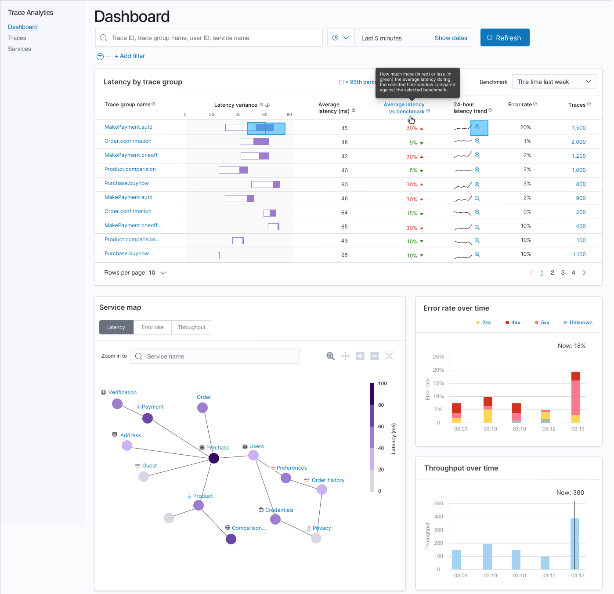
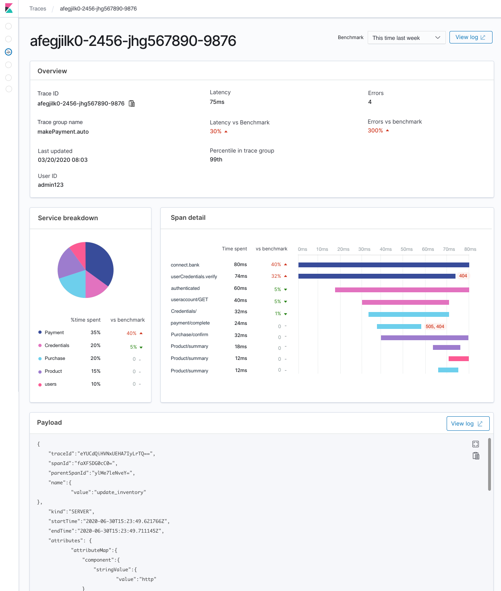

# RFC - Trace Analytics
## 1. Overview
Open Distro for Elasticsearch (ODFE) users already store their log data which allows them to access log events in their services. However, with the log data alone, the user can not pinpoint where the error occurred or what caused the poor performance. This means they need to another datastore or going into a different codebase to determine the context of the log event. The overall result is that the user has to rely on multiple products, software, log data, and human ingenuity to track down problems with their systems. The goal is to reduce the number of contexts switches a 
user must do in order to solve a problem in production, we will achieve this through a set of Application Performance Management (APM) features. 
As the first step, in 2020 we will offer Trace Analytics, which will allow users to store trace information and provide them a holistic view of their
 service under observation.

## 2. Approach
The Trace Analytics feature will embrace the Open Telemetry standard and provide the required plugins and adapters to integrate with the ecosystem. 
Adoption to the OpenTelemetry ecosystem will benefit users od existing tracing standards like Zipkin and OpenTracing to use the Trace Analytics feature.
To support the trace analytics feature we will build a new service called SITUP, which receives trace data from the OpenTelemetry collector, process them to elasticsearch friendly docs, and stores them users' elasticsearch clusters. The trace analytics will also provide a Kibana plugin that will provide user-friendly dashboards on the stored trace data. 

SITUP will collect OpenTelemetry format trace data and store them in two elasticsearch indices,

* apm-trace-raw-v1 -  This index will store the trace data from user services. The data in this index will be closer to the source with minimal additional processing.
* apm-service-map-v1 -  This index will process the trace data from user services and detect the relationship between services. 

These two indices will be used by the Kibana plugin to provide instant dashboards like below,

NOTE: The above Kibana dashboards are mockup UIs, they are subject to changes.

## Providing Feedback
If you have comments or feedback on our plans for Trace Analytics, please comment on the GitHub repository of this project to discuss.